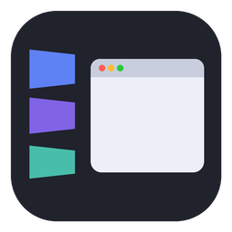

# Stage Manager for Windows

macOS 스테이지 매니저를 Windows 10/11에서 구현한 가볍고 빠른 창 관리자입니다.
지금 쓰는 창은 가운데에 두고, 나머지 창은 왼쪽 사이드바에 비스듬히 기울어진 카드로 모아 둡니다.

<p align="center"></p>

## 다운로드

**[최신 버전 받기 (Releases)](https://github.com/ilfpns/Mulddungddunge/releases/latest)**

| 파일 | 설명 |
|---|---|
| `StageManager-<버전>-win64.exe` | **설치형 (권장)**. 실행하면 끝. 관리자 권한이 필요 없고, 시작 메뉴와 "설정 > 앱"에 등록되며 거기서 제거할 수 있습니다. |
| `StageManager-<버전>-portable.zip` | 설치 없이 쓰는 버전. 압축을 풀고 `stage-manager.exe`를 실행합니다. |

- **필요한 것**: Windows 10 1903(빌드 18362) 이상, 64비트. **따로 설치할 런타임이나 프레임워크는 없습니다** (.NET, VC++ 재배포 패키지 모두 불필요, Windows 기본 구성요소만 사용).
- 처음 실행하면 Windows SmartScreen이 "알 수 없는 게시자" 경고를 띄울 수 있습니다(코드 서명 인증서가 없어서). **추가 정보 → 실행**을 누르면 됩니다.
- 켜면 지금 창 하나만 남기고 나머지 창은 최소화됩니다. 끄려면 작업 표시줄 트레이 아이콘을 우클릭 → **종료**.

## 기능

| 동작 | 결과 |
|---|---|
| 사이드바 카드 클릭 / **Alt+1~N** | 그 창이 카드 자리에서 날아와 가운데에 뜨고, 지금 창은 사이드바로 들어감 |
| 카드를 끌어 화면 가운데에 놓기 | 지금 창은 그대로 두고, 놓은 자리에 그 창을 원래 크기로 함께 띄움 |
| 카드 우클릭 | **탭 고정**(그 데스크톱의 사이드바 위쪽에 항상 유지, 재시작 후에도 유지) / **창 닫기** / **앱 종료**(창을 모두 닫고, 5초 뒤에도 화면에 창 없이 남아 있으면 백그라운드까지 종료. 저장 확인 창이 떠 있으면 그대로 둠) / **설정** |
| 창 두 개를 화면 분할로 나란히 배치 | 두 창 모두 가운데(무대)에 남고, 사이드바 쪽 창은 사이드바 옆으로 자동으로 맞춰짐 |
| 파일 열기 같은 대화상자 | 원래 창과 한 카드로 묶여 함께 들어가고 함께 나옴 |
| 트레이로 숨는 앱(카카오톡 등)을 닫음 | 카드가 남아 누르면 다시 열림. Esc 등으로 완전히 닫힌 창은 카드 없이 사라짐 |
| 크롬/엣지에서 설치한 웹앱(YouTube, GitHub 등) | 브라우저가 아니라 그 웹앱의 로고로 표시 |
| 창 최소화 (버튼, Win+D, 네 손가락 아래로 쓸기) | 창이 제자리에서 사이드바로 빨려 들어감 |
| Alt+Tab, 작업 표시줄, 새 창 열기 | 이전 창이 사이드바로 들어감 |
| 창을 최대화하거나 사이드바 쪽으로 옮김 | 사이드바가 화면 밖으로 접힘. **화면 끝에 마우스**를 대면 다시 나옴 |
| 전체화면 앱(게임, 영상) | 사이드바가 완전히 비키고 Alt 단축키도 앱에 양보, 끝나면 다시 나옴 |
| 가상 데스크톱 전환 | 데스크톱마다 그 데스크톱의 창만 사이드바에 표시 |
| 트레이 아이콘 우클릭 | 설정, Windows 시작 시 실행, 종료 |

사이드바에는 데스크톱마다 최근 창이 기본 4개(설정에서 1~6개) 보입니다. 화면 공간을 예약하지 않으므로 최대화한 창은 화면 전체를 씁니다.

## 설정

사이드바 우클릭(또는 트레이 메뉴) → **설정**. 바꾸는 즉시 적용되고 `HKCU\Software\StageManager\Settings`에 저장되어 재부팅 후에도 유지됩니다.

| 탭 | 항목 |
|---|---|
| 일반 | Windows 시작 시 실행, 단축키 켜기/끄기, 단축키 조합(Alt / Ctrl+Alt / Shift+Alt), 카드 개수(1~6), 사이드바 위치(왼쪽/오른쪽), 표시할 모니터 |
| 모양 | 카드 기울기(0~60°), 카드 크기(80~130%), 애니메이션 속도(빠르게/보통/느리게/끄기), 썸네일 화질, 아이콘만 보기(절전: 창 캡처 없이 앱 아이콘 카드만) |
| 동작 | 창이 가리면 사이드바 숨기기, 화면 가장자리로 다시 불러오기, 분할한 창을 사이드바 옆에 맞추기, 트레이로 숨는 앱도 카드 유지 |
| 앱 | 앱별로 사이드바 관리 켜기/끄기, **X로 종료**(카카오톡처럼 X를 누르면 트레이로 숨는 앱을 백그라운드까지 끄기) |
| 고정 | 고정한 탭을 데스크톱별로 보고 개별/전체 해제 |
| 정보 | 버전, 현재 RAM·GPU 메모리 사용량, GitHub |

## 자원 사용

"있는지 없는지 모를 정도"를 목표로 만들었습니다. 측정값은 Windows 11, AMD 내장 그래픽 기준입니다.

| 상태 | CPU | GPU | 메모리 |
|---|---|---|---|
| 대기 | 0% (이벤트 없는 10초 구간 여러 번 모두 0ms) | 0% | 작업 관리자 기준 약 4~7MB (8MB를 넘으면 스스로 정리) |
| 창 전환 1회 | 약 12~16ms (CPU 사이클 기준) | DWM이 애니메이션 처리 | 변화 없음 |

- GPU 메모리(작업 관리자의 전용 GPU 메모리)는 시작 직후 약 90MB, 사용하면서 140MB 안팎입니다. 카드 이미지와 화면 합성용이며, 대기 중 GPU 사용률은 0%라 배터리나 발열에는 영향이 없습니다. 더 줄이려면 설정에서 **썸네일 화질: 낮음** 또는 **아이콘만 보기**를 켜세요.

- 순수 Win32 + C++/WinRT + `Windows.UI.Composition`. exe 하나(약 360KB)로 동작합니다.
- 애니메이션은 모두 Composition 키프레임이라 DWM(화면 합성기)이 GPU로 실행합니다. 앱은 그리기 루프가 없습니다.
- 창 썸네일은 실시간이 아니라, 창이 사이드바로 들어갈 때 `Windows.Graphics.Capture`로 **한 장만** 찍은 스냅샷입니다. 이미 최소화돼 있던 창은 DWM이 보관한 마지막 모습(작업 표시줄 미리보기와 같은 것)을 한 번 받아 씁니다.
- 창 변화 감지는 이벤트 훅(포커스, 최소화, 셸 훅, 가운데 창 스레드의 이동 이벤트)만 쓰고 타이머나 폴링이 없습니다.
- 평소에는 사이드바 영역(접혔을 때는 2px)만 덮고, 전환하는 동안에만 화면 전체로 커집니다.
- 전환 비용을 줄이려고: 최근(3초 이내) 스냅샷은 다시 찍지 않고 재사용, 캡처 세션 준비는 작업 스레드에서, 카드의 가상 데스크톱은 캐시(탐색기 호출 없음), 앱 아이콘은 앱별 캐시, 대체 카드는 최소화된 창에만 그립니다.

## 소스에서 빌드

```powershell
git clone https://github.com/ilfpns/Mulddungddunge.git
cd Mulddungddunge
powershell -ExecutionPolicy Bypass -File tools\setup-dev.ps1   # 빌드 도구 자동 설치 (한 번만)
build.bat                                                        # bin\stage-manager.exe
powershell -ExecutionPolicy Bypass -File packaging\package.ps1  # dist\ 에 설치형 exe와 zip
```

- `tools\setup-dev.ps1`은 winget으로 Git과 **Visual Studio 2022 Build Tools(C++ 워크로드, Windows 11 SDK)**를 설치합니다. 이미 있으면 아무것도 설치하지 않습니다. Build Tools 설치 중 관리자 권한을 한 번 묻습니다.
- `build.bat`은 vswhere로 Visual Studio를 찾아 `cl.exe` 한 번으로 빌드합니다. 컴파일러 임시 파일은 `obj\tmp`에, 오류 위치 조회용 맵 파일은 `obj\stage-manager.map`에 만듭니다.
- 패키지 생성에는 Windows 기본 도구(IExpress, PowerShell)만 씁니다.

## 구조

```
src/
  main.cpp           진입점, 단일 인스턴스, 크래시 처리기
  Stage.*            사이드바, 카드, 전환/드래그/최소화 애니메이션, 자동 숨김, 메뉴, 단축키, 이벤트 처리
  Settings.cpp       설정 모달 (Direct2D로 그림, 변경 시에만 다시 그림)
  Config.*           설정 값 읽기/저장 (레지스트리)
  Snapshot.*         D3D/D2D 장치, 1프레임 창 캡처, 최소화 창 캡처, 아이콘, 대체 카드, 텍스트
  WindowTracker.*    관리 대상 창 판별, 앱 식별(웹앱 포함), 대화상자-원래 창 연결, 창 위치, 전체화면 판단
res/                 아이콘, 버전 정보(version.h), 매니페스트
packaging/           설치/제거 스크립트, 패키지 빌드 스크립트
tools/setup-dev.ps1  빌드 도구 설치
```

## 문제 해결

- **최소화 애니메이션이 사라졌어요**: 앱은 실행 중에 Windows 기본 최소화 애니메이션을 끄고 종료할 때 되돌립니다. 원래 값은 `HKCU\Software\StageManager\MinAnimate`에 보관해서, 비정상 종료되더라도 다음 실행이나 설치/제거 때 복구합니다.
- **오류 기록**: `%TEMP%\stage-manager.log`. 크래시가 나면 `rva=0x...`가 남고, `obj\stage-manager.map`에서 그 주소의 함수를 찾을 수 있습니다.
- **자세한 이벤트 추적**: 빈 파일 `%TEMP%\stage-manager.trace`를 만든 뒤 앱을 시작하면 포커스, 최소화, 데스크톱 전환, 사이드바 상태, 고정 이벤트가 기록됩니다. 파일을 지우고 다시 시작하면 꺼집니다.
- **설정 초기화**: 앱을 끈 뒤 `HKCU\Software\StageManager` 키를 지우면 설정과 고정 목록이 초기화됩니다.

## 알려진 제한

- 한 번에 모니터 하나만 관리합니다(설정에서 선택).
- 관리자 권한으로 실행된 창은 일반 권한인 이 앱이 최소화/복원할 수 없습니다(Windows UIPI).
- 항상 위에 떠 있는 창(데스크톱 펫, PIP 플레이어 등)은 관리하지 않습니다.
- 코드 서명이 없어 처음 실행 시 SmartScreen 경고가 뜰 수 있습니다.
